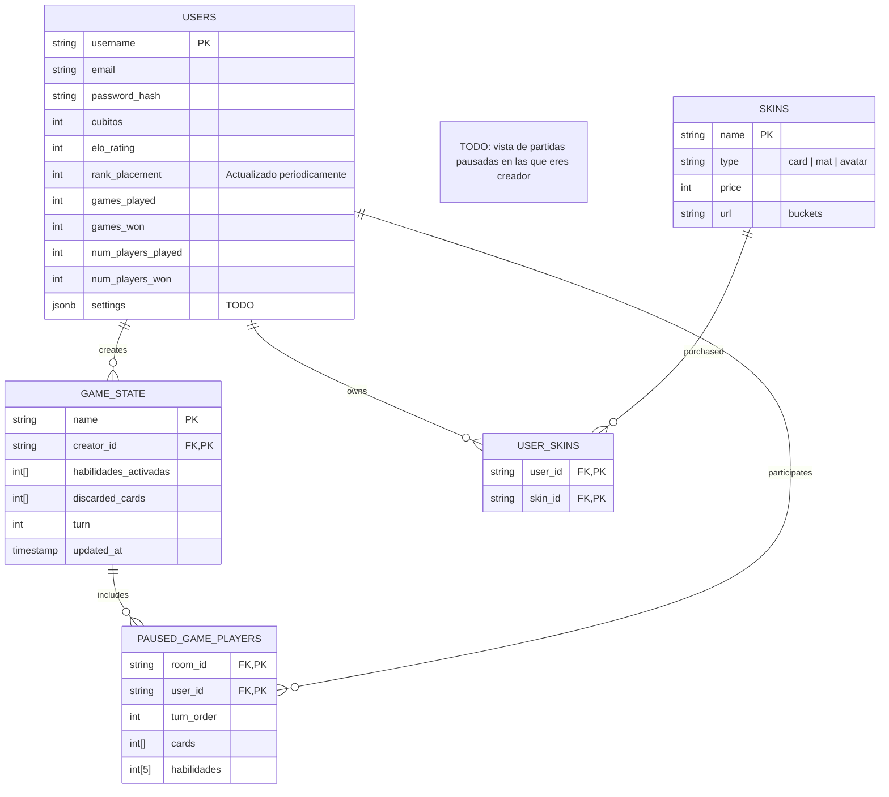

```mermaid
erDiagram

    USERS {
        string username PK
        string email
        string password_hash
        int cubitos
        int elo_rating
		int rank_placement "Actualizado periodicamente"
        int games_played
        int games_won
		int num_players_played
        int num_players_won
		jsonb settings "TODO"
    }

    PAUSED_GAME_PLAYERS {
        string room_id FK, PK
        string user_id FK, PK
		int turn_order
		int[] cards
		int[5] habilidades
    } 

    GAME_STATE {
        string name PK
        string creator_id FK, PK 
		int[] habilidades_activadas 
		int[] discarded_cards
		int turn
        timestamp updated_at
    } "TODO: vista de partidas pausadas en las que eres creador"

    SKINS {
        string name PK
        string type "card | mat | avatar"
        int price
		string url "buckets"
    }

    USER_SKINS {
        string user_id FK,PK
        string skin_id FK,PK
    }

    USERS ||--o{ USER_SKINS : owns
    SKINS ||--o{ USER_SKINS : purchased
    USERS ||--o{ GAME_STATE : creates
    GAME_STATE ||--o{ PAUSED_GAME_PLAYERS : includes
    USERS ||--o{ PAUSED_GAME_PLAYERS : participates
```
