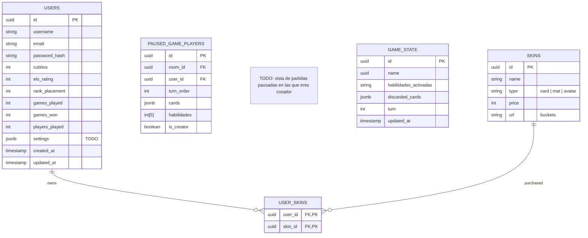

```mermaid
erDiagram

    USERS {
        uuid id PK
        string username
        string email
        string password_hash
        int cubitos
        int elo_rating
		int rank_placement
        int games_played
        int games_won
		int players_played
		jsonb settings "TODO"
        timestamp created_at
        timestamp updated_at
    }

    PAUSED_GAME_PLAYERS {
        uuid id PK
        uuid room_id FK
        uuid user_id FK
		int turn_order
		jsonb cards
		int[5] habilidades
        boolean is_creator
    } "TODO: vista de partidas pausadas en las que eres creador"

    GAME_STATE {
        uuid id PK
        uuid name
        string habilidades_activadas
		jsonb discarded_cards
		int turn
        timestamp updated_at
    }

    SKINS {
        uuid id PK
        string name
        string type  "card | mat | avatar"
        int price
		string url "buckets"
    }

    USER_SKINS {
        uuid user_id FK,PK
        uuid skin_id FK,PK
    }

    USERS ||--o{ USER_SKINS : owns
    SKINS ||--o{ USER_SKINS : purchased
```
